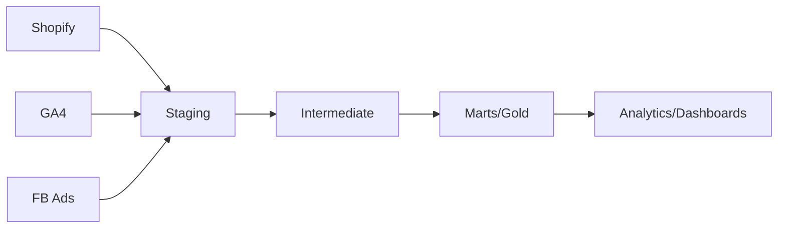

# E-Commerce Analytics Platform

[](https://www.getdbt.com/)
[](https://www.snowflake.com/)
[](https://opensource.org/licenses/MIT)

**A production-grade analytics engineering project leveraging dbt 1.8+ features to build a robust, governed data platform on Snowflake.**

## 🎯 Project Goals

Build a multi-source e-commerce analytics platform covering the complete Analytics Engineering workflow:
- ✅ Medallion architecture (staging → intermediate → marts)
- ✅ Comprehensive data quality framework
- ✅ CI/CD automation
- ✅ Production-ready documentation

## 📊 Architecture & Data Flow
```
Sources (Shopify, GA, Facebook Ads)
    ↓
Staging Layer (standardization) ← 📍 Day 1 Complete
    ↓
Intermediate Layer (business logic)
    ↓
Marts Layer (analytics-ready)
```




## 🏗️ Current Status: Day 1 Complete ✅

**Milestone:** Infrastructure established and initial data load successful.

### Data Pipeline Progress
| Layer | Models | Tests | Status | Key Features |
| :--- | :--- | :--- | :--- | :--- |
| **Sources** | 4 tables | 20+ | ✅ Loaded | Freshness SLAs |
| **Staging** | 1/8 models | 10 | 🚧 In Progress | Naming Standards |
| **Intermediate** | 0 models | 0 | 📅 Planned | Business Logic |
| **Marts** | 0 models | 0 | 📅 Planned | Data Contracts |

### Infrastructure Highlights

- ✅ **Snowflake:** Configured with `ANALYTICS_ENGINEER` RBAC and dedicated `ECOMMERCE_RAW` / `ECOMMERCE_ANALYTICS` databases.
- ✅ **Python Setup:** Automated synthetic data generation via `Faker` and `NumPy` (116,500 records).
- ✅ **Security:** Zero hardcoded credentials; managed via `.env` and `env_var`.
- ✅ **Git workflow:** Protected `main` branch with structured PR template.

## 📈 Data Sources Inventory

| Source | Table | Records | Grain | Update Pattern |
| :--- | :--- | :--- | :--- | :--- |
| **Shopify** | `customers` | 5,000 | 1 row per customer | SCD Type 1 |
| **Shopify** | `orders` | 25,000 | 1 row per order | Append/Update |
| **GA4** | `sessions` | 50,000 | 1 row per session | Append |
| **FB Ads** | `ad_performance` | 36,500 | 1 row per ad/day | Snapshot |

## 🚀 Quick Start (Windows/VS Code)

```PowerShell
# 1. Clone repository
git clone [https://github.com/jkschola/ecommerce-analytics-platform.git](https://github.com/jkschola/ecommerce-analytics-platform.git)
cd ecommerce-analytics-platform

# 2. Environment Setup
python -m venv venv
.\venv\Scripts\activate
pip install -r requirements.txt

# 3. Data Generation & Loading
# Ensure .env is configured with Snowflake credentials
python scripts/generate_sample_data.py
cd scripts
python load_to_snowflake.py
cd ..

# 4. Initialize dbt
cd ecommerce_analytics
dbt deps
dbt debug  # Verify connection

# 5. Build & Test
dbt run --select staging
dbt test
dbt docs generate && dbt docs serve
```


## 📚 Tech Stack

Component | Technology | Version |
| :--- | :--- | :--- |
| **Data Warehouse** | Snowflake | 1.8.0+ |
| **Transformation** | dbt Core | 1.8.0+ |
| **Data Generation** | Python (Faker/Pandas) | 3.10+ |
| **CI/CD** | GitHub Actions | Coming Soon |
| **Key Packages** | `dbt-utils`, `codegen`, `dbt-expectations` | Latest |

## 📅 Development Roadmap

### ✅ Week 1: Foundation (Day 1-5)
- [x] **Day 1:** Environment setup, source configuration, first staging model
- [ ] **Day 2:** Completing Staging (Shopify, GA4, FB) + Unit Tests.
- [ ] **Day 3:** Marketing Attribution logic in Intermediate layer.
- [ ] **Day 4:** Marts Layer with **Enforced Data Contracts**.
- [ ] **Day 5:** Incremental models + snapshots

### 📅 Week 2: Quality & Governance (Day 6-10)
- [ ] **Day 6:** Advanced testing (custom tests, dbt-expectations)
- [ ] **Day 7:** Model contracts and versioning
- [ ] **Day 8:** CI/CD with GitHub Actions
- [ ] **Day 9:** Exposures and deployment workflow
- [ ] **Day 10:** Performance optimization + final polish

## 🎓Certification Coverage

This project maps directly to the **dbt Analytics Engineering Certification** topics:

* ✅ **Developing dbt models & Documentation**
* 📅 **Model governance & Data Contracts**
* 📅 **Managing pipelines & dbt State**
* ✅ **Implementing dbt tests & Source Freshness**


## 🤝 Contributing

This is a portfolio project, but feedback is welcome! Please open an issue or PR.


## 📫 Contact

**Janvier S** - *Analytics Engineer* [LinkedIn](https://www.linkedin.com/in/jkschola/) | [Portfolio](https://github.com/jkschola/)


[](https://www.linkedin.com/in/jkschola/)
[](https://github.com/jkschola/)

---

*Last updated: Day 1 Complete - February 9, 2026*