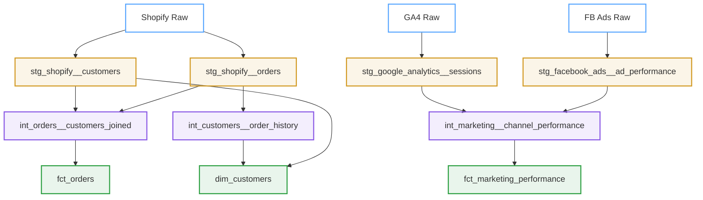

# E-Commerce Analytics Platform

[](https://www.getdbt.com/)
[](https://www.snowflake.com/)
[]()
[](https://opensource.org/licenses/MIT)

**A production-grade analytics engineering project demonstrating modern data stack best practices with dbt 1.8+ and Snowflake.**

## 🎯 Project Overview

Building a multi-source e-commerce analytics platform following strict Analytics Engineering best practices:
- ✅ Medallion architecture (staging → intermediate → marts)
- ✅ Comprehensive data quality framework (226 tests)
- ✅ Production-ready documentation with lineage and data contracts
- ✅ Dimensional Modeling (Kimball Star Schema)
- 🚧 CI/CD automation (in progress)

## 📊 Architecture & Data Flow
```text
Raw Data (Snowflake)
    ↓
Staging Layer (4/4 models) ✅ COMPLETE
    ├── stg_shopify__customers
    ├── stg_shopify__orders
    ├── stg_google_analytics__sessions
    └── stg_facebook_ads__ad_performance
    ↓
Intermediate Layer (3/3 models) ✅ COMPLETE
    ├── int_customers__order_history
    ├── int_marketing__channel_performance
    └── int_orders__customers_joined
    ↓
Marts Layer (3/3 models) ✅ COMPLETE
    ├── Core: dim_customers, fct_orders
    └── Marketing: fct_marketing_performance
```

```mermaid
graph TD
    %% Define semantic, light/dark mode friendly classes
    classDef raw fill:transparent,stroke:#58a6ff,stroke-width:2px;
    classDef staging fill:#d299221a,stroke:#d29922,stroke-width:2px;
    classDef intermediate fill:#8957e51a,stroke:#8957e5,stroke-width:2px;
    classDef marts fill:#2ea0431a,stroke:#2ea043,stroke-width:2px;

    %% Raw Sources
    A[Shopify Raw]:::raw --> B[stg_shopify__customers]:::staging
    A --> C[stg_shopify__orders]:::staging
    D[GA4 Raw]:::raw --> E[stg_google_analytics__sessions]:::staging
    F[FB Ads Raw]:::raw --> G[stg_facebook_ads__ad_performance]:::staging
    
    %% Intermediate
    C --> H[int_customers__order_history]:::intermediate
    B --> I[int_orders__customers_joined]:::intermediate
    C --> I
    
    E --> J[int_marketing__channel_performance]:::intermediate
    G --> J
    
    %% Marts
    H --> K[dim_customers]:::marts
    B --> K
    I --> L[fct_orders]:::marts
    J --> M[fct_marketing_performance]:::marts
```

## 🏗️ Current Status: Core Data Warehouse Complete

**Milestone:** Staging, Intermediate, and Marts layers are 100% complete. All models are documented, heavily tested (226 total tests passing), and ready for BI consumption.

### Data Pipeline Progress

| Layer | Models | Tests | Coverage | Status |
|-------|--------|-------|----------|--------|
| **Sources** | 4 tables | 30+ | Source freshness | ✅ Configured |
| **Staging** | 4/4 models | 93 | 100% documented | ✅ **Complete** |
| **Intermediate** | 3/3 models | 45 | 100% documented | ✅ **Complete** |
| **Marts** | 3/3 models | 88 | 100% documented | ✅ **Complete** |

### Layer Details

#### ✅ Staging Layer (Source Aligned)
- `stg_shopify__customers` (10 tests)
- `stg_shopify__orders` (36 tests) 
- `stg_google_analytics__sessions` (22 tests)
- `stg_facebook_ads__ad_performance` (25 tests)

**Key Features:**
- Column renaming for naming consistency
- Data type standardization
- Source freshness monitoring
- Configuration-as-code for dynamic taxonomy mapping

#### ✅ Intermediate Layer (Entity & Process Aligned)
- `int_customers__order_history` ✅ (23 tests)
  - Customer lifecycle metrics (first/last order, tenure)
  - Revenue aggregations (total, refunds, net)
  - Customer segmentation (7 tiers)
  - RFM recency classification
  - Configurable reference date for recency

- `int_orders__customers_joined` ✅ (9 tests)
  - Orders enriched with core customer attributes
  - Order sequence calculation (identifying first-time vs. repeat orders)
  - Dimensional denormalization to optimize downstream BI performance
  
- `int_marketing__channel_performance` ✅ (13 tests)
  - Unified web sessions + paid ads performance
  - Event-driven `FULL OUTER JOIN` to rescue orphaned spend
  - Custom financial reconciliation singular tests (`assert_ad_spend_matches_staging`)

#### ✅ Marts Layer (Business Aligned - Kimball Star Schema)
- `dim_customers` ✅ (30 tests)
  - Type 1 SCD (Current State) customer dimension.
  - Defensive `COALESCE` logic to maintain visibility of unconverted signups in the BI layer.
  - Dynamic presentation-layer flags (`is_high_value_customer`, `is_churned_customer`) driven by `dbt_project.yml` variables.

- `fct_orders` ✅ (28 tests)
  - Core transaction fact table at the order grain.
  - Pre-computed time dimensions to eliminate `DATE_TRUNC` compute overhead in BI tools.
  - Boolean business flags (`is_first_order`, `is_high_value_order`) for rapid dashboard filtering.

- `fct_marketing_performance` ✅ (30 tests)
  - Daily campaign fact table serving ROI, CPC, CPA, and ROAS metrics.
  - Single-column surrogate keys (`dbt_utils.generate_surrogate_key`) for highly optimized downstream joins.
  - Defensive `NULLIF()` and `IS NOT NULL` math (Three-Valued Logic) to prevent division-by-zero execution errors and boolean filter corruption.
  - Integer-prefixed segmentation tiers (e.g., `'1. Low'`, `'2. Medium'`) to force native alphabetical sorting in BI tools without manual configuration.

## 📈 Data Sources

| Source | Table | Records | Grain | Date Range |
|--------|-------|---------|-------|------------|
| **Shopify** | `customers` | 5,000 | One per customer | All Time |
| **Shopify** | `orders` | 25,000 | One per order | 2023-2024 |
| **Google Analytics** | `sessions` | 50,000 | One per session | 2023-2024 |
| **Facebook Ads** | `ad_performance` | 36,500 | One per ad/day | 2023-2024 |
| **Total** | - | **116,500** | - | - |

## 🚀 Quick Start

### Prerequisites
- **Python 3.10+**
- **Snowflake Account** (30-day free trial available)
- **Git**

### Setup
```bash
# 1. Clone repository
git clone https://github.com/jkschola/ecommerce-analytics-platform.git
cd ecommerce-analytics-platform

# 2. Python environment
python -m venv venv
.\venv\Scripts\activate  # Windows (venv/bin/activate for Mac/Linux)
pip install -r requirements.txt

# 3. Configure Snowflake credentials
# Edit ~/.dbt/profiles.yml with your Snowflake credentials

# 4. Generate and load data
python scripts/generate_sample_data.py
cd scripts
python load_to_snowflake.py
cd ..

# 5. Run dbt
cd ecommerce_analytics
dbt deps
dbt debug  # Verify connection

# 6. Build and Test the pipeline
dbt build  # Builds and tests staging, intermediate, and marts

# 7. View documentation
dbt docs generate
dbt docs serve  # Opens at http://localhost:8080
```

## 📚 Tech Stack

| Component | Technology | Version | Purpose |
| :--- | :--- | :--- | :--- |
| **Data Warehouse** | Snowflake | Latest | Data storage & compute |
| **Transformation** | dbt Core | 1.8.0+ | SQL transformation framework |
| **Data Generation** | Python | 3.10+ | Synthetic data creation |
| **Orchestration** | GitHub Actions | N/A | CI/CD automation (planned) |
| **Version Control** | Git/GitHub | N/A | Code versioning & collaboration |


### dbt Packages
```yaml
packages:
  - package: dbt-labs/dbt_utils
    version: 1.1.1
    # Purpose: Advanced testing & generic macros

  - package: dbt-labs/codegen
    version: 0.12.1
    # Purpose: Base documentation and YAML generation
```

## 🎓 dbt Analytics Engineering Certification Coverage

This project demonstrates mastery of the core certification exam topics:

- ✅ **Topic 1: Developing dbt models:** Surrogate keys, DRY CTEs, Jinja compilation.
- ✅ **Topic 2: Fact & Dimension Design:** Denormalization trade-offs, Type 1 SCDs, star schemas.
- ✅ **Topic 3: Debugging Data Errors:** Resolved upstream synthetic data anomalies (`refund_rate > 100%`) using SQL caps (`least()`).
- ✅ **Topic 5: Implementing tests:** 226 tests (generic, singular, bounds checking via `dbt_utils.expression_is_true`).
- ✅ **Topic 6: Documentation:** Parameterized markdown descriptions via YAML and `dbt_project.yml`.

## 📅 Development Roadmap

**Phase 1: Core Architecture** ✅ Completed
- Full Medallion architecture (Staging, Intermediate, Marts)
- Comprehensive data quality framework (226 tests)
- Configuration-as-Code for dynamic business thresholds

**Phase 2: CI/CD & Production Governance** 🚧 In Progress
- Implement GitHub Actions for Slim CI/CD deployment
- Integrate `dbt-expectations` for advanced anomaly detection
- Apply dbt 1.8 model contracts and versioning
- Implement incremental materializations for large-scale fact tables

## 🔍 Quality Metrics

### Test Coverage (226 Total Tests - 100% Pass Rate)
```text
├── Staging: 93 tests (unique, not_null, accepted_values)
├── Intermediate: 45 tests (bounds checking, financial reconciliation)
└── Marts: 88 tests 
    ├── Grain Validation (Surrogate Keys & PKs)
    ├── Rigorous dbt_utils.expression_is_true bounds (>= 0)
    └── Exact String Matching via accepted_values for BI Tiers

```

### Documentation Coverage
- **Models:** 10/10 (100%)
- **Columns:** 150+/150+ (100%)
- **Doc blocks:** 7 (revenue logic, order status, engagement levels, ad KPIs, customer segments, recency tiers, traffic taxonomy)

## 🛠️ Key Technical Architecture Decisions

### 1. Configuration-as-Code for Marketing Taxonomy
**Problem:** Hardcoded UTM tracking strings inside SQL `CASE` statements created brittle pipelines that broke when marketing changed their naming conventions.
**Solution:** Abstracted taxonomy rules into `dbt_project.yml` variables. Leveraged Jinja `join()` filters to dynamically compile YAML lists into SQL `IN (...)` clauses, ensuring logic, tests, and documentation remain perfectly synchronized.

### 2. Event-Driven FULL OUTER JOIN
**Problem:** A standard `LEFT JOIN` in the marketing model silently orphaned €8.7k of Facebook Ad spend on days with zero Google Analytics web sessions.
**Solution:** Rejected a Cartesian date-spine approach (which would have bloated warehouse row count by 83%). Instead, implemented a `FULL OUTER JOIN` to rescue the orphaned spend while exclusively generating rows for actual real-world events.

### 3. Environment-Aware Time Travel
**Problem:** Static synthetic data (ending in 2024) evaluated against `current_timestamp()` caused all test customers to instantly appear as "churned" in development.
**Solution:** Implemented a global `recency_reference_date` Jinja variable. This allows seamless toggling between static mock dates for DEV testing and real-time execution in PROD.

### 4. Three-Valued Logic & Defensive Booleans (NULL Handling in Customer Segmentation)
**Problem:** Customers with zero lifetime orders evaluated to `NULL` for the `is_active_customer` flag instead of `false`, which corrupts binary filters in BI dashboards.
**Solution:** Implemented strict `COALESCE` fallbacks and explicit `IS NOT NULL` SQL guardrails to safely handle database unknowns, guaranteeing absolute True/False states for the presentation layer.


### 5. Schema Naming Strategy
Using dbt's custom schema feature: `DBT_DEV_STAGING`, `DBT_DEV_INTERMEDIATE`, `DBT_PROD_MARTS`

**Benefits:**
- Clear layer separation
- Easy permission management (analysts → marts only)
- Scalable for large projects

## 📖 Documentation

- **dbt Docs:** Run `dbt docs serve` to view full lineage and documentation.
- **Architecture Decisions:** Tracked natively via PR descriptions and in-file ADRs.
- **Setup Guides:** See `docs/snowflake_setup.md`

## 🤝 Contributing

This is a portfolio project demonstrating Analytics Engineering best practices. Feedback welcome via issues or PRs!

## 📫 Contact

**Janvier S** - Analytics Engineer

[](https://www.linkedin.com/in/jkschola/)
[](https://github.com/jkschola/)
[](https://github.com/jkschola/ecommerce-analytics-platform)

---

**Project Status:** 🚧 Phase 2: CI/CD & Production Readiness
**Last Updated:** March 20, 2026  

**Completion:** ~85% (Core Architecture Complete)