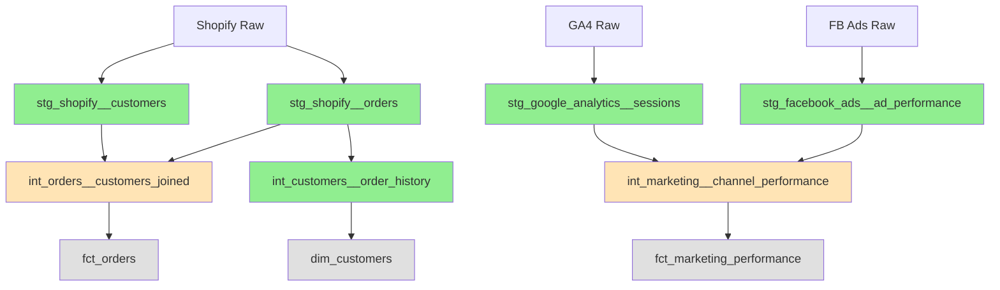

# E-Commerce Analytics Platform

[](https://www.getdbt.com/)
[](https://www.snowflake.com/)
[]()
[](https://opensource.org/licenses/MIT)

**A production-grade analytics engineering project demonstrating modern data stack best practices with dbt 1.8+ and Snowflake.**

## 🎯 Project Overview

Building a multi-source e-commerce analytics platform following Analytics Engineering best practices:
- ✅ Medallion architecture (staging → intermediate → marts)
- ✅ Comprehensive data quality framework (116+ tests)
- ✅ Production-ready documentation with lineage
- 🚧 CI/CD automation (in progress)
- ✅ Model governance with data contracts

## 📊 Architecture & Data Flow
```
Raw Data (Snowflake)
    ↓
Staging Layer (4 models) ✅ COMPLETE
    ├── stg_shopify__customers
    ├── stg_shopify__orders
    ├── stg_google_analytics__sessions
    └── stg_facebook_ads__ad_performance
    ↓
Intermediate Layer (1/3 models) 🚧 IN PROGRESS
    └── int_customers__order_history ✅
    ├── int_orders__customers_joined (planned)
    └── int_marketing__channel_performance (planned)
    ↓
Marts Layer (0 models) 📅 PLANNED
    ├── Core: dim_customers, fct_orders
    ├── Marketing: fct_marketing_performance
    └── Finance: fct_revenue
```

```mermaid
graph TD
    A[Shopify Raw] --> B[stg_shopify__customers]
    A --> C[stg_shopify__orders]
    D[GA4 Raw] --> E[stg_google_analytics__sessions]
    F[FB Ads Raw] --> G[stg_facebook_ads__ad_performance]
    
    C --> H[int_customers__order_history]
    B --> I[int_orders__customers_joined]
    C --> I
    
    E --> J[int_marketing__channel_performance]
    G --> J
    
    H --> K[dim_customers]
    I --> L[fct_orders]
    J --> M[fct_marketing_performance]
    
    style B fill:#90EE90
    style C fill:#90EE90
    style E fill:#90EE90
    style G fill:#90EE90
    style H fill:#90EE90
    style I fill:#FFE4B5
    style J fill:#FFE4B5
    style K fill:#E0E0E0
    style L fill:#E0E0E0
    style M fill:#E0E0E0
```

## 🏗️ Current Status: Intermediate Models In Progress

**Milestone:** Staging layer complete (93 tests passing), intermediate layer started (23 tests passing).

### Data Pipeline Progress

| Layer | Models | Tests | Coverage | Status |
|-------|--------|-------|----------|--------|
| **Sources** | 4 tables | 30+ | Source freshness | ✅ Configured |
| **Staging** | 4/4 models | 93 | 100% documented | ✅ **Complete** |
| **Intermediate** | 1/3 models | 23 | 100% documented | 🚧 **In Progress** |
| **Marts** | 0/7 models | 0 | - | 📅 Planned |

### Layer Details

#### ✅ Staging Layer (Complete)
- `stg_shopify__customers` (10 tests)
- `stg_shopify__orders` (36 tests) 
- `stg_google_analytics__sessions` (22 tests)
- `stg_facebook_ads__ad_performance` (25 tests)

**Key Features:**
- Column renaming for consistency
- Data type standardization
- Source freshness monitoring
- Comprehensive generic tests

#### 🚧 Intermediate Layer (In Progress)
- `int_customers__order_history` ✅ (23 tests)
  - Customer lifecycle metrics (first/last order, tenure)
  - Revenue aggregations (total, refunds, net)
  - Customer segmentation (7 tiers)
  - RFM recency classification
  - Configurable reference date for recency

- `int_orders__customers_joined` 📅 (Planned)
  - Orders enriched with customer attributes
  
- `int_marketing__channel_performance` 📅 (Planned)
  - Unified sessions + ads performance

## 📈 Data Sources

| Source | Table | Records | Grain | Date Range |
|--------|-------|---------|-------|------------|
| **Shopify** | customers | 5,000 | One per customer | - |
| **Shopify** | orders | 25,000 | One per order | 2023-2024 |
| **Google Analytics** | sessions | 50,000 | One per session | 2023-2024 |
| **Facebook Ads** | ad_performance | 36,500 | One per ad/day | 2023-2024 |
| **Total** | - | **116,500** | - | - |

## 🚀 Quick Start

### Prerequisites
- Python 3.10+
- Snowflake account (30-day trial available)
- Git

### Setup
```powershell
# 1. Clone repository
git clone https://github.com/jkschola/ecommerce-analytics-platform.git
cd ecommerce-analytics-platform

# 2. Python environment
python -m venv venv
.\venv\Scripts\activate  # Windows
# source venv/bin/activate  # Mac/Linux
pip install -r requirements.txt

# 3. Configure Snowflake credentials
# Edit ~/.dbt/profiles.yml with your Snowflake credentials

# 4. Generate and load data
python scripts/generate_sample_data.py
cd scripts
python load_to_snowflake.py
cd ..

# 5. Run dbt
cd ecommerce_analytics
dbt deps
dbt debug  # Verify connection

# 6. Build models
dbt run --select staging      # Build staging layer
dbt run --select intermediate # Build intermediate layer
dbt test                      # Run all tests (116 tests)

# 7. View documentation
dbt docs generate
dbt docs serve  # Opens at http://localhost:8080
```

## 📚 Tech Stack

| Component | Technology | Version | Purpose |
|-----------|-----------|---------|---------|
| **Data Warehouse** | Snowflake | Latest | Data storage & compute |
| **Transformation** | dbt Core | 1.8.0+ | SQL transformation framework |
| **Data Generation** | Python | 3.10+ | Synthetic data creation |
| **Orchestration** | GitHub Actions | - | CI/CD automation (planned) |
| **Version Control** | Git/GitHub | - | Code versioning & collaboration |

### dbt Packages
```yaml
- dbt-labs/dbt_utils (1.1.1) - Advanced testing & macros
- dbt-labs/codegen (0.12.1) - Documentation generation
```

## 🎓 dbt Analytics Engineering Certification Coverage

This project demonstrates mastery of all 8 certification exam topics:

| Topic | Status | Evidence |
|-------|--------|----------|
| **1. Developing dbt models** | ✅ Complete | 5 models, clean DAG, DRY principles |
| **2. Model governance** | 📅 Day 7 | Contracts, versioning, access control |
| **3. Debugging errors** | ✅ Demonstrated | NULL handling fix, type mismatch fix |
| **4. Managing pipelines** | 📅 Day 8 | Incremental models, snapshots |
| **5. Implementing tests** | ✅ Complete | 116 tests (generic, custom, dbt_utils) |
| **6. Documentation** | ✅ Complete | Full docs with lineage, doc blocks |
| **7. External dependencies** | ✅ Complete | Source freshness, exposures (planned) |
| **8. Leveraging state** | 📅 Day 8-9 | State selectors, dbt retry |

### Key Certification Concepts Demonstrated

- ✅ **Modularity & DRY:** Reusable customer segmentation logic in intermediate layer
- ✅ **Testing Strategy:** 116 tests across sources, staging, and intermediate
- ✅ **Clean DAGs:** 4 staging → 1 intermediate → marts (clear lineage)
- ✅ **Source Configuration:** Freshness checks, loaded_at fields
- ✅ **Documentation:** Doc blocks, column descriptions, model lineage
- ✅ **Debugging:** NULL handling, type mismatches, YAML errors (documented in commits)
- 📅 **Model Contracts:** Coming in Day 7
- 📅 **Incremental Models:** Coming in Day 5
- 📅 **Snapshots:** Coming in Day 5

## 📅 Development Roadmap

### ✅ Week 1: Foundation (Day 1-3)
- [x] **Day 1:** Environment setup, source configuration, first staging model
- [x] **Day 2:** Complete staging layer (4 models, 93 tests)
- [x] **Day 3:** Start intermediate layer (customer order history) ← **You are here**
- [ ] **Day 4:** Complete intermediate + start marts layer
- [ ] **Day 5:** Incremental models + snapshots

### 📅 Week 2: Quality & Governance (Day 6-10)
- [ ] **Day 6:** Advanced testing (dbt-expectations, custom tests)
- [ ] **Day 7:** Model contracts and versioning (dbt 1.8 features)
- [ ] **Day 8:** CI/CD with GitHub Actions (slim CI)
- [ ] **Day 9:** Exposures and deployment workflow
- [ ] **Day 10:** Performance optimization + final polish

## 🔍 Quality Metrics

### Test Coverage
```
Total Tests: 116
├── Staging: 93 tests
│   ├── unique/not_null: 42
│   ├── relationships: 4
│   ├── accepted_values: 25
│   └── dbt_utils.expression_is_true: 22
└── Intermediate: 23 tests
    ├── unique/not_null: 14
    ├── accepted_values: 4
    ├── expression_is_true (model-level): 3
    └── expression_is_true (column-level): 2

Pass Rate: 100%
```

### Documentation Coverage
- **Models:** 5/5 (100%)
- **Columns:** 106/106 (100%)
- **Doc blocks:** 6 (revenue logic, order status, engagement levels, ad KPIs, customer segments, recency tiers)

## 🛠️ Key Technical Decisions

### 1. Configurable Reference Date for Recency
**Problem:** Static demo data (ends 2024-12-31) + `current_timestamp()` = all customers appear inactive.

**Solution:** Configurable `recency_reference_date` variable:
```yaml
# dbt_project.yml
vars:
  recency_reference_date: '2024-12-31'  # Dev: end of data range
  # Production uses current_timestamp() automatically
```

### 2. NULL Handling in Customer Segmentation
**Discovery:** 410 customers with orders but zero completed orders returned NULL for `is_active_customer`.

**Fix:** Explicit NULL handling in boolean logic:
```sql
(last_order_date is not null 
 and days_since_last_order <= 90) as is_active_customer
```

### 3. Schema Naming Strategy
Using dbt's custom schema feature: `DBT_DEV_STAGING`, `DBT_DEV_INTERMEDIATE`, `DBT_PROD_MARTS`

**Benefits:**
- Clear layer separation
- Easy permission management (analysts → marts only)
- Scalable for large projects

## 📖 Documentation

- **dbt Docs:** Run `dbt docs serve` to view full lineage and documentation
- **Setup Guides:** See `docs/snowflake_setup.md`
- **Test Results:** See `docs/day1_test_results.md`
- **Retrospectives:** Daily learnings in `docs/dayN_retrospective.md`

## 🤝 Contributing

This is a portfolio project demonstrating Analytics Engineering best practices. Feedback welcome via issues or PRs!

## 📫 Contact

**Janvier S** - Analytics Engineer

[](https://www.linkedin.com/in/jkschola/)
[](https://github.com/jkschola/)
[](https://github.com/jkschola/ecommerce-analytics-platform)

---

**Project Status:** 🚧 Active Development 
**Last Updated:** February 9, 2026  
**Completion:** 40% (4/10 days)