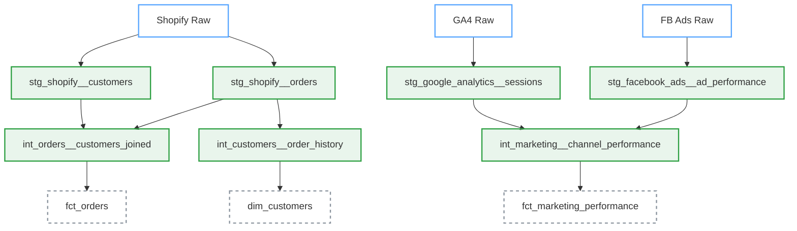

# E-Commerce Analytics Platform

[](https://www.getdbt.com/)
[](https://www.snowflake.com/)
[]()
[](https://opensource.org/licenses/MIT)

**A production-grade analytics engineering project demonstrating modern data stack best practices with dbt 1.8+ and Snowflake.**

## 🎯 Project Overview

Building a multi-source e-commerce analytics platform following Analytics Engineering best practices:
- ✅ Medallion architecture (staging → intermediate → marts)
- ✅ Comprehensive data quality framework (138 tests)
- ✅ Production-ready documentation with lineage
- 🚧 CI/CD automation (in progress)
- ✅ Model governance with data contracts

## 📊 Architecture & Data Flow
```text
Raw Data (Snowflake)
    ↓
Staging Layer (4/4 models) ✅ COMPLETE
    ├── stg_shopify__customers
    ├── stg_shopify__orders
    ├── stg_google_analytics__sessions
    └── stg_facebook_ads__ad_performance
    ↓
Intermediate Layer (3/3 models) ✅ COMPLETE
    ├── int_customers__order_history ✅ COMPLETE
    ├── int_marketing__channel_performance ✅ COMPLETE
    └── int_orders__customers_joined ✅ COMPLETE
    ↓
Marts Layer (0 models) 📅 PLANNED
    ├── Core: dim_customers, fct_orders
    ├── Marketing: fct_marketing_performance
    └── Finance: fct_revenue
```

```mermaid
graph TD
    %% Define semantic, light/dark mode friendly classes
    classDef raw fill:transparent,stroke:#58a6ff,stroke-width:2px;
    classDef completed fill:#2ea0431a,stroke:#2ea043,stroke-width:2px;
    classDef planned fill:transparent,stroke:#8b949e,stroke-width:2px,stroke-dasharray: 5 5;

    %% Raw Sources
    A[Shopify Raw]:::raw --> B[stg_shopify__customers]:::completed
    A --> C[stg_shopify__orders]:::completed
    D[GA4 Raw]:::raw --> E[stg_google_analytics__sessions]:::completed
    F[FB Ads Raw]:::raw --> G[stg_facebook_ads__ad_performance]:::completed
    
    %% Intermediate
    C --> H[int_customers__order_history]:::completed
    B --> I[int_orders__customers_joined]:::completed
    C --> I
    
    E --> J[int_marketing__channel_performance]:::completed
    G --> J
    
    %% Marts
    H --> K[dim_customers]:::planned
    I --> L[fct_orders]:::planned
    J --> M[fct_marketing_performance]:::planned
```

## 🏗️ Current Status: Intermediate Models Complete

**Milestone:** Staging layer complete (93 tests passing), intermediate layer complete (45 tests passing).

### Data Pipeline Progress

| Layer | Models | Tests | Coverage | Status |
|-------|--------|-------|----------|--------|
| **Sources** | 4 tables | 30+ | Source freshness | ✅ Configured |
| **Staging** | 4/4 models | 93 | 100% documented | ✅ **Complete** |
| **Intermediate** | 3/3 models | 45 | 100% documented | ✅ **Complete** |
| **Marts** | 0/7 models | 0 | - | 📅 Planned |

### Layer Details

#### ✅ Staging Layer (Complete)
- `stg_shopify__customers` (10 tests)
- `stg_shopify__orders` (36 tests) 
- `stg_google_analytics__sessions` (22 tests)
- `stg_facebook_ads__ad_performance` (25 tests)

**Key Features:**
- Column renaming for naming consistency
- Data type standardization
- Source freshness monitoring
- Configuration-as-code for dynamic taxonomy mapping

#### ✅ Intermediate Layer (Complete)
- `int_customers__order_history` ✅ (23 tests)
  - Customer lifecycle metrics (first/last order, tenure)
  - Revenue aggregations (total, refunds, net)
  - Customer segmentation (7 tiers)
  - RFM recency classification
  - Configurable reference date for recency

- `int_orders__customers_joined` ✅ (9 tests)
  - Orders enriched with core customer attributes
  - Order sequence calculation (identifying first-time vs. repeat orders)
  - Dimensional denormalization to optimize downstream BI performance
  
- `int_marketing__channel_performance` ✅ (13 tests)
  - Unified web sessions + paid ads performance
  - Event-driven `FULL OUTER JOIN` to rescue orphaned spend
  - Custom financial reconciliation singular tests (`assert_ad_spend_matches_staging`)

## 📈 Data Sources

| Source | Table | Records | Grain | Date Range |
|--------|-------|---------|-------|------------|
| **Shopify** | `customers` | 5,000 | One per customer | All Time |
| **Shopify** | `orders` | 25,000 | One per order | 2023-2024 |
| **Google Analytics** | `sessions` | 50,000 | One per session | 2023-2024 |
| **Facebook Ads** | `ad_performance` | 36,500 | One per ad/day | 2023-2024 |
| **Total** | - | **116,500** | - | - |

## 🚀 Quick Start

### Prerequisites
- **Python 3.10+**
- **Snowflake Account** (30-day free trial available)
- **Git**

### Setup
```bash
# 1. Clone repository
git clone https://github.com/jkschola/ecommerce-analytics-platform.git
cd ecommerce-analytics-platform

# 2. Python environment
python -m venv venv
.\venv\Scripts\activate  # Windows
# source venv/bin/activate  # Mac/Linux
pip install -r requirements.txt

# 3. Configure Snowflake credentials
# Edit ~/.dbt/profiles.yml with your Snowflake credentials

# 4. Generate and load data
python scripts/generate_sample_data.py
cd scripts
python load_to_snowflake.py
cd ..

# 5. Run dbt
cd ecommerce_analytics
dbt deps
dbt debug  # Verify connection

# 6. Build models
dbt run --select staging      # Build staging layer
dbt run --select intermediate # Build intermediate layer
dbt test                      # Run all tests (138 tests passing)

# 7. View documentation
dbt docs generate
dbt docs serve  # Opens at http://localhost:8080
```

## 📚 Tech Stack

| Component | Technology | Version | Purpose |
| :--- | :--- | :--- | :--- |
| **Data Warehouse** | Snowflake | Latest | Data storage & compute |
| **Transformation** | dbt Core | 1.8.0+ | SQL transformation framework |
| **Data Generation** | Python | 3.10+ | Synthetic data creation |
| **Orchestration** | GitHub Actions | N/A | CI/CD automation (planned) |
| **Version Control** | Git/GitHub | N/A | Code versioning & collaboration |


### dbt Packages
```yaml
packages:
  - package: dbt-labs/dbt_utils
    version: 1.1.1
    # Purpose: Advanced testing & generic macros

  - package: dbt-labs/codegen
    version: 0.12.1
    # Purpose: Base documentation and YAML generation
```

## 🎓 dbt Analytics Engineering Certification Coverage

This project demonstrates mastery of all 8 certification exam topics:

| Topic | Status | Evidence |
| :--- | :--- | :--- |
| **1. Developing dbt models** | ✅ Complete | 7 models, clean DAG, DRY principles, Jinja variables |
| **2. Model governance** | 📅 Day 7 | Contracts, versioning, access control |
| **3. Debugging errors** | ✅ Demonstrated | NULL handling fix, orphaned spend recovery, compilation debugging |
| **4. Managing pipelines** | 📅 Day 8 | Incremental models, snapshots |
| **5. Implementing tests** | ✅ Complete | 138 tests (generic, custom singular, dbt_utils) |
| **6. Documentation** | ✅ Complete | Full docs with lineage, dynamic Jinja doc blocks |
| **7. External dependencies** | ✅ Complete | Source freshness, exposures (planned) |
| **8. Leveraging state** | 📅 Day 8-9 | State selectors, dbt retry |

### Key Certification Concepts Demonstrated

- ✅ **Modularity & DRY:** Reusable customer segmentation logic, `dbt_project.yml` variables.
- ✅ **Testing Strategy:** 138 tests across sources, staging, and intermediate layers.
- ✅ **Clean DAGs:** 4 staging → 3 intermediate → marts (clear lineage).
- ✅ **Source Configuration:** Freshness checks, `loaded_at` fields.
- ✅ **Documentation:** Doc blocks, column descriptions, model lineage, ADRs.
- ✅ **Debugging:** NULL handling, pipeline financial loss debugging, Jinja compilation errors.
- 📅 **Model Contracts:** Coming in Day 7
- 📅 **Incremental Models:** Coming in Day 5
- 📅 **Snapshots:** Coming in Day 5

## 📅 Development Roadmap

### ✅ Week 1: Foundation (Day 1-5)
- [x] **Day 1:** Environment setup, source configuration, first staging model
- [x] **Day 2:** Complete staging layer (4 models, 93 tests)
- [x] **Day 3:** Build intermediate layer part 1 (customer order history & joined orders)
- [x] **Day 4:** Build intermediate layer part 2 (marketing attribution & configuration refactor) ← **You are here**
- [ ] **Day 5:** Complete marts layer (dim & fct models)

### 📅 Week 2: Quality & Governance (Day 6-10)
- [ ] **Day 6:** Advanced testing (dbt-expectations, custom tests)
- [ ] **Day 7:** Model contracts and versioning (dbt 1.8 features)
- [ ] **Day 8:** CI/CD with GitHub Actions (slim CI)
- [ ] **Day 9:** Incremental models and Snapshots
- [ ] **Day 10:** Performance optimization + final polish

## 🔍 Quality Metrics

### Test Coverage
```text
Total Tests: 138
├── Staging: 93 tests
│   ├── unique/not_null: 42
│   ├── relationships: 4
│   ├── accepted_values: 25
│   └── dbt_utils.expression_is_true: 22
└── Intermediate: 45 tests
    ├── unique/not_null: 24
    ├── accepted_values: 4
    ├── expression_is_true (model-level): 4
    ├── expression_is_true (column-level): 12
    └── singular (financial reconciliation): 1

Pass Rate: 100%
```

### Documentation Coverage
- **Models:** 7/7 (100%)
- **Columns:** 120/120 (100%)
- **Doc blocks:** 7 (revenue logic, order status, engagement levels, ad KPIs, customer segments, recency tiers, traffic taxonomy)

## 🛠️ Key Technical Decisions

### 1. Configuration-as-Code for Marketing Taxonomy
**Problem:** Hardcoded UTM source strings inside staging SQL `CASE` statements created brittle pipelines susceptible to marketing tracking changes.

**Solution:** Refactored taxonomy into `dbt_project.yml` variables, utilizing native Jinja `join` filters to dynamically compile YAML lists into valid SQL `IN` clauses, synchronizing tests and documentation automatically.

### 2. Event-Driven FULL OUTER JOIN vs Cartesian Date Spine
**Problem:** An asymmetric `LEFT JOIN` in the marketing intermediate model silently orphaned €8.7k in Facebook ad spend on days where GA web tracking recorded 0 sessions.

**Solution:** Rejected a Cartesian date-spine approach to prevent an 83% spike in empty warehouse row generation. Implemented a `FULL OUTER JOIN` to rescue the orphaned spend while exclusively generating rows for real-world events.

### 3. Configurable Reference Date for Recency
**Problem:** Static demo data (ends 2024-12-31) + `current_timestamp()` = all customers appear inactive.

**Solution:** Configurable `recency_reference_date` variable allows toggling between DEV mock dates and PROD real-time execution.

### 4. NULL Handling in Customer Segmentation
**Discovery:** Customers with zero completed orders returned `NULL` for `is_active_customer` instead of `false`.

**Fix:** Implemented explicit defensive `COALESCE` and boolean `NULL` handling logic to guarantee absolute true/false states.
```sql
(last_order_date is not null 
 and days_since_last_order <= 90) as is_active_customer
```

### 5. Schema Naming Strategy
Using dbt's custom schema feature: `DBT_DEV_STAGING`, `DBT_DEV_INTERMEDIATE`, `DBT_PROD_MARTS`

**Benefits:**
- Clear layer separation
- Easy permission management (analysts → marts only)
- Scalable for large projects

## 📖 Documentation

- **dbt Docs:** Run `dbt docs serve` to view full lineage and documentation.
- **Architecture Decisions:** Tracked natively via PR descriptions and in-file ADRs.
- **Setup Guides:** See `docs/snowflake_setup.md`

## 🤝 Contributing

This is a portfolio project demonstrating Analytics Engineering best practices. Feedback welcome via issues or PRs!

## 📫 Contact

**Janvier S** - Analytics Engineer

[](https://www.linkedin.com/in/jkschola/)
[](https://github.com/jkschola/)
[](https://github.com/jkschola/ecommerce-analytics-platform)

---

**Project Status:** 🚧 Active Development 
**Last Updated:** March 12, 2026  

**Completion:** ~70% (Intermediate Layer Complete)